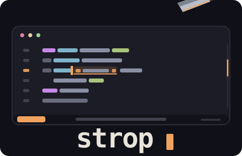

<div align="center">
  
  <h3>see the cut before you make it.</h3>
  <p>Neovim's hands · Helix's spine · rootle's eyes · GitLens' memory</p>
  <p>
    <a href="https://strop.dev">strop.dev</a> ·
    <a href="https://github.com/stropdev/strop/releases">what's new</a> ·
    <a href="https://crates.io/crates/strop-editor">crates.io</a>
  </p>
</div>


**strop** is a modal text editor in Rust: Neovim grammar on a Helix-class core, with
world-class search/git baked in — and the operator-pending preview: every pending
operation renders its target range live, before you commit. `ci[` shows you the cut.

## Install

```sh
curl -fsSL https://strop.dev/install.sh | sh     # prebuilt static binary (linux/macOS)
brew install stropdev/tap/strop                  # homebrew (formula; macOS cask is prebuilt)
cargo install strop-editor --locked              # crates.io
mise use cargo:strop-editor                      # mise
```

Already installed? `strop update` self-updates tarball installs.

## The grammar in one card

```
h j k l w b e 0 $ gg G %      motions          i a A o O            insert
d y c > < + motion/object     operators        dd yy cc D C Y s x   shortcuts
iw i" i' i( i[ i{             text objects     f t /                find & search
v V                           visual           u ctrl-r .           undo, redo, repeat
"a …                          registers        :w :q :e :vs :sp     ex line · splits

Space  f files · b buffers · / grep            C-w h l j k w        panes
Space g  l log · h history · b blame · y/o permalink · u/s/p hunk
```

Everything pending previews live — the preview is the same resolver that executes, so
it cannot lie. Surround (`ys`/`cs`/`ds`), per-project sessions, undo history that
crosses restarts, tree-sitter highlighting for ten languages, git gutter + blame +
SHA-resolved permalinks over OSC52.

## Links

- [strop.dev](https://strop.dev) — demo, palettes, install
- [plans/](plans/) — the numbered design contracts everything answers to

MIT license · © 2026 [Tarek Nawara](https://github.com/tknawara)
